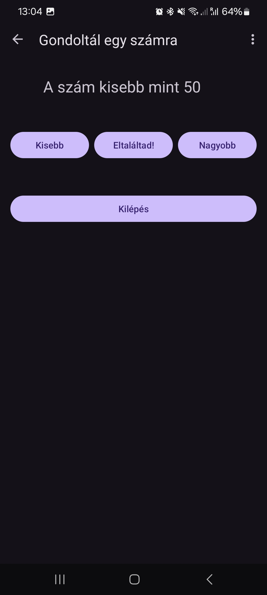

# Okostelefon és IoT eszközök programozása beadandó

## Feladatleírás

Feladatom egy számkitalálós játék. A játékos gondol egy számra 1 és 100 között. A gép pedig megpróbálja azt kitalálni. Kisebb, nagyobb kérdésekkel, tartományfelezéssel igyekszik rátalálni a megoldásra.

Az applikáció egy fő aktivitásból áll, melyen két fragmens cseréjével a játékszabályok és a játéktér cserélődik. Lehetőség van a menüből végleg kilépni, ezzel az applikáció futása végleg megszakad.


## Komponensek leírásai

Az egyes komponensek leírásai:

### activity_main.xml

Ez az XML elrendezésfájl egy `CoordinatorLayout`-ot definiál, amely tartalmaz egy `AppBarLayout`-ot `MaterialToolbar`-ral, valamint egy külön elrendezés beillesztését a fő tartalom számára.

1. **CoordinatorLayout**: Ez egy kibővített `FrameLayout`, amely koordinálja a gyerekeinek viselkedését, különösen az olyan Material Design komponensek esetében, mint az `AppBarLayout`.

    ```xml
    <androidx.coordinatorlayout.widget.CoordinatorLayout
        xmlns:android="http://schemas.android.com/apk/res/android"
        xmlns:app="http://schemas.android.com/apk/res-auto"
        xmlns:tools="http://schemas.android.com/tools"
        android:layout_width="match_parent"
        android:layout_height="match_parent"
        android:fitsSystemWindows="true"
        tools:context=".MainActivity">
    ```

    - `xmlns:android`, `xmlns:app`, és `xmlns:tools`: Ezek XML névterek, amelyeket az elrendezésfájlban használnak.
    - `android:layout_width` és `android:layout_height`: Beállítják a `CoordinatorLayout` szélességét és magasságát, hogy megegyezzen a szülő méreteivel.
    - `android:fitsSystemWindows`: Ha igazra van állítva, az elrendezés beállítja a illesztését a rendszerablakokhoz (például státuszsávhoz) való illeszkedés érdekében.
    - `tools:context`: Ezt az Android Studio használja a tervezési eszközöknél, és megadja az Activity kontextusát.

2. **AppBarLayout**: Ez egy függőleges `LinearLayout`, amelyet tipikusan egy `Toolbar` és más nézetek, például `TabLayout` köré használnak.

    ```xml
    <com.google.android.material.appbar.AppBarLayout
        android:layout_width="match_parent"
        android:layout_height="wrap_content"
        android:fitsSystemWindows="true">
    ```

    - `android:layout_width` és `android:layout_height`: Beállítja az `AppBarLayout` méreteit. A szélesség megegyezik a szülőével, a magasság pedig igazodik a tartalomhoz.
    - `android:fitsSystemWindows`: Biztosítja, hogy az `AppBarLayout` illeszkedjen a rendszerablakokhoz, hasonlóan a `CoordinatorLayout`-hoz.

3. **MaterialToolbar**: Ez egy speciális típusú `Toolbar`, amelyet a Material Components könyvtár biztosít. Az alkalmazás felső sávjaként használják.

    ```xml
    <com.google.android.material.appbar.MaterialToolbar
        android:id="@+id/toolbar"
        android:layout_width="match_parent"
        android:layout_height="?attr/actionBarSize" />
    ```

    - `android:id`: A toolbar egyedi azonosítója.
    - `android:layout_width` és `android:layout_height`: Beállítja a szélességet, hogy megegyezzen a szülővel, és a magasságot a standard action bar méretére.

4. **Include**: Ez a címke beilleszt egy másik elrendezésfájlt, amelyet a `layout` attribútum határoz meg.

    ```xml
    <include layout="@layout/content_main" />
    ```

    - `layout`: Hivatkozik egy másik elrendezésfájlra, amelynek neve `content_main.xml`, és amely tartalmazza az activity fő tartalmát.

Az egész struktúra egy olyan elrendezést hoz létre, ahol az `AppBarLayout` a `MaterialToolbar`-ral rögzítve van a tetején, és az activity tartalma alatta van beillesztve.

### content_main.xml

Ez az XML elrendezésfájl egy `ConstraintLayout`-ot definiál, amely egyetlen `NavHostFragment`-et tartalmaz. Ez a `NavHostFragment` fogja kezelni az alkalmazás navigációját, a `@navigation/nav_graph`-ben meghatározott navigációs gráf segítségével.

### ConstraintLayout
- **xmlns:android**: Az Android attribútumok szabványos XML névtere.
- **xmlns:app**: Egyéni attribútumok névtere, amelyeket például a `ConstraintLayout` és a Navigációs komponensek biztosítanak.
- **android:layout_width="match_parent"**: A `ConstraintLayout` szélessége megegyezik a szülő szélességével.
- **android:layout_height="match_parent"**: A `ConstraintLayout` magassága megegyezik a szülő magasságával.
- **app:layout_behavior**: Ez az attribútum gyermeknézetek viselkedésének megadására szolgál, gyakran használják a `CoordinatorLayout`-tal.

### NavHostFragment
- **fragment**: Ezzel a taggel lehet fragmentet hozzáadni az XML elrendezéshez.
- **android:id="@+id/nav_host_fragment_content_main"**: Egyedi azonosító a fragment számára, amelyet a kódban vagy más XML fájlokban lehet hivatkozni.
- **android:name="androidx.navigation.fragment.NavHostFragment"**: A fragment osztálynevének megadása. Itt a `NavHostFragment` az AndroidX Navigációs komponensből származik.
- **android:layout_width="0dp"**: A fragment szélessége 0dp, ami azt jelenti, hogy a tényleges szélességet a megadott korlátok határozzák meg.
- **android:layout_height="0dp"**: A fragment magassága 0dp, ami azt jelenti, hogy a tényleges magasságot a megadott korlátok határozzák meg.
- **app:defaultNavHost="true"**: Ez az attribútum jelzi, hogy ez a `NavHostFragment` az alapértelmezett navigációs gazda. Kezelni fogja a rendszer vissza gomb eseményeit.
- **app:layout_constraintBottom_toBottomOf="parent"**: A fragment alsó részét a szülő `ConstraintLayout` alsó részéhez köti.
- **app:layout_constraintEnd_toEndOf="parent"**: A fragment jobb oldalát a szülő `ConstraintLayout` jobb oldalához köti.
- **app:layout_constraintStart_toStartOf="parent"**: A fragment bal oldalát a szülő `ConstraintLayout` bal oldalához köti.
- **app:layout_constraintTop_toTopOf="parent"**: A fragment felső részét a szülő `ConstraintLayout` felső részéhez köti.
- **app:navGraph="@navigation/nav_graph"**: Megadja azt a navigációs gráf erőforrást, amely meghatározza a navigációs struktúrát és műveleteket a `NavHostFragment` számára.

### A Korlátok Magyarázata
A `NavHostFragment` minden oldalát a `ConstraintLayout` (szülő) minden oldalához köti, vagyis az egész szülő elrendezési területet kitölti. A szélesség és magasság mindkettő `0dp`, ami egy gyakori gyakorlat a `ConstraintLayout`-ban, jelezve, hogy a tényleges méretet a megadott korlátok határozzák meg, nem pedig egy fix méret.

### Navigációs Gráf
A navigációs gráf (`@navigation/nav_graph`) egy XML erőforrás, amely meghatározza az összes navigációs célállomást (fragmensek, aktivitások) és az azokat összekötő navigációs műveleteket. Ez a gráf lehetővé teszi a `NavHostFragment` számára, hogy kezelje a fragment tranzakciókat az alkalmazáson belüli navigációs műveletek alapján.

### fragment_first.xml

Az XML elrendezés egy `NestedScrollView`-t definiál, amely egy `ConstraintLayout`-ot tartalmaz, benne egy `TextView`-val és egy `Button`-nel. 

```xml
<?xml version="1.0" encoding="utf-8"?>
<androidx.core.widget.NestedScrollView xmlns:android="http://schemas.android.com/apk/res/android"
    xmlns:app="http://schemas.android.com/apk/res-auto"
    xmlns:tools="http://schemas.android.com/tools"
    android:layout_width="match_parent"
    android:layout_height="match_parent"
    tools:context=".FirstFragment">

    <androidx.constraintlayout.widget.ConstraintLayout
        android:layout_width="match_parent"
        android:layout_height="match_parent"
        android:padding="16dp">

        <TextView
            android:id="@+id/textview_first"
            android:layout_width="wrap_content"
            android:layout_height="wrap_content"
            android:layout_marginTop="20dp"
            android:text="@string/rules"
            android:textAlignment="center"
            android:textSize="24sp"
            app:layout_constraintEnd_toEndOf="parent"
            app:layout_constraintStart_toStartOf="parent"
            app:layout_constraintTop_toTopOf="parent" />

        <Button
            android:id="@+id/button_first"
            android:layout_width="0dp"
            android:layout_height="wrap_content"
            android:layout_marginTop="20dp"
            android:text="@string/start"
            app:layout_constraintBottom_toBottomOf="parent"
            app:layout_constraintEnd_toEndOf="parent"
            app:layout_constraintHorizontal_bias="0.0"
            app:layout_constraintStart_toStartOf="parent"
            app:layout_constraintTop_toBottomOf="@+id/textview_first" />

    </androidx.constraintlayout.widget.ConstraintLayout>
</androidx.core.widget.NestedScrollView>
```


### fragment_second.xml

Ez az XML elrendezés:

```xml
<?xml version="1.0" encoding="utf-8"?>
<androidx.core.widget.NestedScrollView xmlns:android="http://schemas.android.com/apk/res/android"
    xmlns:app="http://schemas.android.com/apk/res-auto"
    xmlns:tools="http://schemas.android.com/tools"
    android:layout_width="match_parent"
    android:layout_height="match_parent"
    tools:context=".SecondFragment">

    <androidx.constraintlayout.widget.ConstraintLayout
        android:layout_width="match_parent"
        android:layout_height="match_parent"
        android:padding="16dp">

        <Button
            android:id="@+id/button_second"
            android:layout_width="0dp"
            android:layout_height="wrap_content"
            android:layout_marginTop="50dp"
            android:text="@string/exit"
            app:layout_constraintBottom_toBottomOf="parent"
            app:layout_constraintEnd_toEndOf="parent"
            app:layout_constraintHorizontal_bias="0.0"
            app:layout_constraintStart_toStartOf="parent"
            app:layout_constraintTop_toBottomOf="@+id/smaller"
            app:layout_constraintVertical_bias="1.0" />

        <TextView
            android:id="@+id/questiontxt"
            android:layout_width="wrap_content"
            android:layout_height="wrap_content"
            android:layout_marginLeft="8dp"
            android:layout_marginTop="8dp"
            android:layout_marginRight="8dp"
            android:ems="10"
            android:textSize="24sp"
            app:layout_constraintEnd_toEndOf="parent"
            app:layout_constraintStart_toStartOf="parent"
            app:layout_constraintTop_toTopOf="parent" />

        <Button
            android:id="@+id/smaller"
            android:layout_width="0dp"
            android:layout_height="wrap_content"
            android:text="@string/smaller"
            android:layout_marginTop="50dp"
            android:layout_marginLeft="0dp"
            android:layout_marginRight="8dp"
            android:layout_marginBottom="8dp"
            app:layout_constraintStart_toStartOf="parent"
            app:layout_constraintEnd_toStartOf="@+id/equal"
            app:layout_constraintTop_toBottomOf="@+id/questiontxt" />

        <Button
            android:id="@+id/equal"
            android:layout_width="0dp"
            android:layout_height="wrap_content"
            android:text="@string/equal"
            android:layout_marginTop="50dp"
            android:layout_marginLeft="0dp"
            android:layout_marginRight="0dp"
            android:layout_marginBottom="8dp"
            app:layout_constraintStart_toEndOf="@+id/smaller"
            app:layout_constraintEnd_toStartOf="@+id/bigger"
            app:layout_constraintTop_toBottomOf="@+id/questiontxt" />

        <Button
            android:id="@+id/bigger"
            android:layout_width="0dp"
            android:layout_height="wrap_content"
            android:text="@string/bigger"
            android:layout_marginTop="50dp"
            android:layout_marginLeft="8dp"
            android:layout_marginRight="0dp"
            android:layout_marginBottom="8dp"
            app:layout_constraintEnd_toEndOf="parent"
            app:layout_constraintStart_toEndOf="@+id/equal"
            app:layout_constraintTop_toBottomOf="@+id/questiontxt" />


    </androidx.constraintlayout.widget.ConstraintLayout>
</androidx.core.widget.NestedScrollView>
```

### nav_graph.xml

Definiálja a navigációs gráfot az alkalmazás számára. Két fragmentet (`FirstFragment` és `SecondFragment`) és az ezek közötti navigációs műveleteket határozza meg.

### Fő elemek
- **`<navigation>`**: Ez a navigációs gráf gyökéreleme. Tartalmaz néhány namespace-t:
  - `android`: Szokásos Android namespace általános attribútumokhoz.
  - `app`: Egyedi namespace navigáció specifikus attribútumokhoz.
  - `tools`: Az Android Studio által használt namespace tervezési időben használt attribútumokhoz.
- **`android:id="@+id/nav_graph"`**: A navigációs gráf azonosítója.
- **`app:startDestination="@id/FirstFragment"`**: Jelzi, hogy a `FirstFragment` a kezdő célpont, amikor a navigáció elindul.

### Fragmentek
- **`<fragment>`**: Minden fragment elem egy fragment célpontot határoz meg a navigációs gráfban.
  - **`android:id="@+id/FirstFragment"`**: A `FirstFragment` egyedi azonosítója.
  - **`android:name="com.example.felezo.FirstFragment"`**: A `FirstFragment` teljesen kvalifikált osztályneve.
  - **`android:label="@string/first_fragment_label"`**: A fragment címkéje, amelyet általában az akadálymentesség és a felhasználói felület elemei használnak.
  - **`tools:layout="@layout/fragment_first"`**: Tervezési időben használt attribútum, amely meghatározza a fragmenthez tartozó elrendezés erőforrásfájlját.

### Akciók
- **`<action>`**: Navigációs műveletet határoz meg két célpont között.
  - **`android:id="@+id/action_FirstFragment_to_SecondFragment"`**: Az azonosító, amely a `FirstFragment`-ből a `SecondFragment`-be navigálást jelöli.
  - **`app:destination="@id/SecondFragment"`**: Megadja, hogy ez a művelet a `SecondFragment`-hez navigál.

### Bontása
#### FirstFragment
```xml
<fragment
    android:id="@+id/FirstFragment"
    android:name="com.example.felezo.FirstFragment"
    android:label="@string/first_fragment_label"
    tools:layout="@layout/fragment_first">

    <action
        android:id="@+id/action_FirstFragment_to_SecondFragment"
        app:destination="@id/SecondFragment" />
</fragment>
```
- Ez definiálja a `FirstFragment`-et egy navigációs művelettel, amely a `SecondFragment`-hez vezet.

#### SecondFragment
```xml
<fragment
    android:id="@+id/SecondFragment"
    android:name="com.example.felezo.SecondFragment"
    android:label="@string/second_fragment_label"
    tools:layout="@layout/fragment_second">

    <action
        android:id="@+id/action_SecondFragment_to_FirstFragment"
        app:destination="@id/FirstFragment" />
</fragment>
```
- Ez definiálja a `SecondFragment`-et egy navigációs művelettel, amely visszavezet a `FirstFragment`-hez.

### Navigációs Folyamat
1. A navigáció a `FirstFragment`-tel kezdődik.
2. Az `action_FirstFragment_to_SecondFragment` művelettel lehet navigálni a `FirstFragment`-ből a `SecondFragment`-be.
3. A `SecondFragment`-ben egy másik művelet (`action_SecondFragment_to_FirstFragment`) lehetővé teszi a visszanavigálást a `FirstFragment`-be.

Ez a beállítás kétirányú navigációs folyamatot hoz létre a két fragment között.

### FirstFragment.kt

Az első fregmens kódja, amely annak működését valósítja meg.

1. **Csomagdeklaráció**: `package com.example.felezo` meghatározza a fájl csomagjának nevét.

2. **Importok**: Szükséges importok vannak beillesztve, például az Android keretrendszerből és a támogató könyvtárakból származó osztályok.

3. **Osztálydefiníció**: A `FirstFragment` egy `Fragment` részosztálya.

4. **Nézetkötés**: Nézetkötés használatával lehet hozzáférni a fragmenthez tartozó elrendezés XML-fájl nézeteihez. Az `_binding` egy privát nullálható tulajdonság, ami a nézetkötési példányt tartja.

5. **`onCreateView`**: Ez a metódus felül van írva az elrendezés kibontására (`FragmentFirstBinding`) a nézetkötés segítségével.

6. **`onViewCreated`**: Ez a metódus akkor hívódik meg a `onCreateView()` után, és arra szolgál, hogy inicializálja az UI komponenseket és beállítsa az eseménykezelőket. Itt beállít egy kattintásfigyelőt egy gombra (`buttonFirst`), hogy a gombra kattintáskor másik fragmentre (`SecondFragment`) navigáljon.

7. **`onDestroyView`**: Ez a metódus felül van írva annak érdekében, hogy megtisztítsa a nézetkötési példányra mutató hivatkozásokat, amikor a nézet megsemmisül, megelőzve a memóriaszivárgást.

### MainActivity.kt

Az alkalmazás elsődleges vezérlőeleme. Ez adja meg az alap működési folyamatokat, fűzi össze a felületet.

1. **onCreate()**: Ebben a metódusban inicializálom az activityt. Ebben a módszerben kibontom a layoutot a nézetkötéssel (`ActivityMainBinding.inflate(layoutInflater)`) és beállítom a tartalom nézetet erre a layout gyökér elemére. Ezután beállítom az Action Bar-t a Navigációs Vezérlővel.

2. **onCreateOptionsMenu()**: Ebben a metódusban kibontom a menü forrást (`menu_main.xml`) a paraméterként megadott menübe. Ez a menü fog megjelenni az Action Bar-ban.

3. **onOptionsItemSelected()**: Ez a metódus hívódik meg, amikor egy menüelemet kiválasztanak. Ellenőrzöm, hogy a kiválasztott elem azonosítója megfelel-e a `R.id.action_exit`-nek, és ha igen, befejezem az activityt, és eltávolítom azt a legutóbbi feladatok listájából.

4. **onSupportNavigateUp()**: Ez a metódus hívódik meg, amikor a felhasználó megnyomja az "Up" gombot az Action Bar-ban. A navigációs "up" műveletet a Navigációs Vezérlőre delegálom.

### SecondFragment.kt

A második fregmens kódja, amely annak működését valósítja meg. Ez maga a játéktér.

A program főbb részei:

A játékhoz szükséges változók:

```kotlin
private var num = 0
private var target: Double = 50.0
private var step: Int = 50
```

Ebben a függvényben inicializálom a játék mechanizmusát, valamint fűzöm fel a szükséges akciókat a gombokra:

```kotlin
override fun onViewCreated(view: View, savedInstanceState: Bundle?) {
    super.onViewCreated(view, savedInstanceState)
    start()
    binding.buttonSecond.setOnClickListener {
        start()
        findNavController().navigate(R.id.action_SecondFragment_to_FirstFragment)
    }

    binding.smaller.setOnClickListener() {
        step = ceil(step.toDouble() / 2).toInt()
        target -= step
        showQuestion()
        if (step == 1) {
            showAnswer()
        }
    }

    binding.bigger.setOnClickListener() {
        step = ceil(step.toDouble() / 2).toInt()
        target += step
        showQuestion()
        if (step == 1) {
            showAnswer()
        }
    }

    binding.equal.setOnClickListener() {
        showAnswer()
    }


}
```

Az alábbi segédfüggvények szükségesek a játék futásához:
```kotlin
private fun start() {
    num = (1..100).random()
    target = 50.0
    step = 50
    showQuestion()
}

private fun showQuestion() {
    binding.questiontxt.text = "A szám kisebb mint " + target.toInt().toString()
}

private fun showAnswer() {
    binding.questiontxt.text = "A szám: " + target.toInt().toString()
}
```


### Képernyőképek



